<h3 align = center> 🍀 About Me 🍀 </h3>

&nbsp
&nbsp
</a>&nbsp
</a>&nbsp 

### 📚 Blog
<table><tbody><tr>
<td>
    <a href="https://stonehee99.tistory.com/45">
         
        
DFS와 BFS를 언제 써야 할까 - 그래프 탐색을 이해하는 사고의 흐름 

    </a>
    
이 문서는 그래프 탐색의 대표적인 방법인 DFS와 BFS를 단순히 어떻게 사용하는지가 아니라, 왜 이런 방식으로 동작하...

    
26.01.06

</td>
<td>
    <a href="https://stonehee99.tistory.com/44">
         
        
Spring Boot에서 PostgreSQL Master–Slave Replication 적용하기 

    </a>
    
오늘은 Replication이 구성된 PostgreSQL 환경에서 Spring Boot가 Master(Write) 와 Slave(Read) 를 자동으로 구분해 ...

    
25.11.27

</td>
<td>
    <a href="https://stonehee99.tistory.com/43">
         
        
[요즘 개발자를 위한 시스템 설계 수업] 실무·면접을 모두 잡는 균형 잡힌 입문서 

    </a>
    
시스템 설계를 깊이 있게 공부해 보려는 개발자의 입장에서 이 책을 읽고 느낀 점을 정리해보았습니다!책이 어떻게 구...

    
25.11.23

</td>
</tr>
<tr>
<td>
    <a href="https://stonehee99.tistory.com/42">
         
        
[MySQL] 문자열 데이터를 저장하는 방법 

    </a>
    
개발을 하다 보면 가장 많이 다루게 되는 데이터는 역시 문자열 데이터입니다.백엔드 개발자로서 저는 평소 "문자열 ...

    
25.03.24

</td>
<td>
    <a href="https://stonehee99.tistory.com/41">
         
        
[부트캠프 QA편] 더 탄탄한 소프트웨어를 만들기 위한 테스트 방법 

    </a>
    
한빛미디어 활동을 위해서 책을 제공받아 작성된 서평입니다 안녕하세요! 오늘은 이라는 책을 리뷰해보겠습니다! 이 ...

    
24.07.28

</td>
<td>
    <a href="https://stonehee99.tistory.com/40">
         
        
코틀린과 JPA 같이 쓰지 말자 

    </a>
    
안녕하세요! 최근 지인들과 코틀린 스터디를 시작하게 되어서 코틀린에 대해서 학습을 해보고 있었습니다. 아직 깊이...

    
24.07.25

</td>
</tr>
</tbody></table>
