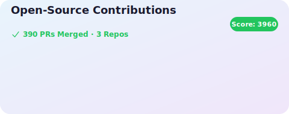

<h3 align = center> 🍀 About Me 🍀 </h3>

&nbsp
&nbsp
</a>&nbsp
</a>&nbsp 

  

  

### 📚 Blog
<table><tbody><tr>
<td>
    <a href="https://stonehee99.tistory.com/50">
         
        
나만의 MCP 서버 만들고 npm에 배포하기 (feat. velog-mcp) 

    </a>
    
최근 AI를 활용한 개발 워크플로우, 이른바 '바이브 코딩(Vibe Coding)'이 대세로 자리 잡았어요.자연스럽게 AI 모델...

    
26.03.11

</td>
<td>
    <a href="https://stonehee99.tistory.com/49">
         
        
JVM 메모리 장애 분석: OutOfMemoryErr or와 StackOverflowE rror를 제대로 이해하기 

    </a>
    
💡 이 글을 읽으면 알 수 있는 것메모리 장애가 발생했을 때 힙부터 의심하는 습관에서 벗어날 수 있어요.OutOfMemor ...

    
26.03.09

</td>
<td>
    <a href="https://stonehee99.tistory.com/48">
         
        
자바 객체는 메모리에 어떻게 배치될까요? 객체 생성 과정과 메모리 레이아웃 

    </a>
    
💡 이 글에서 다루는 내용new 키워드가 실행될 때 JVM 내부에서 어떤 과정이 순서대로 일어나는지 살펴봐요.자바 객체...

    
26.03.09

</td>
</tr>
<tr>
<td>
    <a href="https://stonehee99.tistory.com/47">
         
        
자바 메모리 구조: 힙만으로는 부족한 JVM 런타임 데이터 영역 이해하기 

    </a>
    
💡 이 글을 읽으면 알 수 있는 것OOM이나 StackOverflowE rror가 발생했을 때, 힙 외에 어떤 영역을 확인해야 하는지 ...

    
26.03.09

</td>
<td>
    <a href="https://stonehee99.tistory.com/46">
         
        
ATDD로 바이브코딩 품질 끌어올리기 

    </a>
    
여러분은 바이브 코딩 즐겨 하시나요?바이브코딩은 빠르고 편리하지만, 반복적으로 같은 문제에 부딪히곤 해요.의도와...

    
26.02.25

</td>
<td>
    <a href="https://stonehee99.tistory.com/45">
         
        
DFS와 BFS를 언제 써야 할까 - 그래프 탐색을 이해하는 사고의 흐름 

    </a>
    
이 문서는 그래프 탐색의 대표적인 방법인 DFS와 BFS를 단순히 어떻게 사용하는지가 아니라, 왜 이런 방식으로 동작하...

    
26.01.06

</td>
</tr>
</tbody></table>